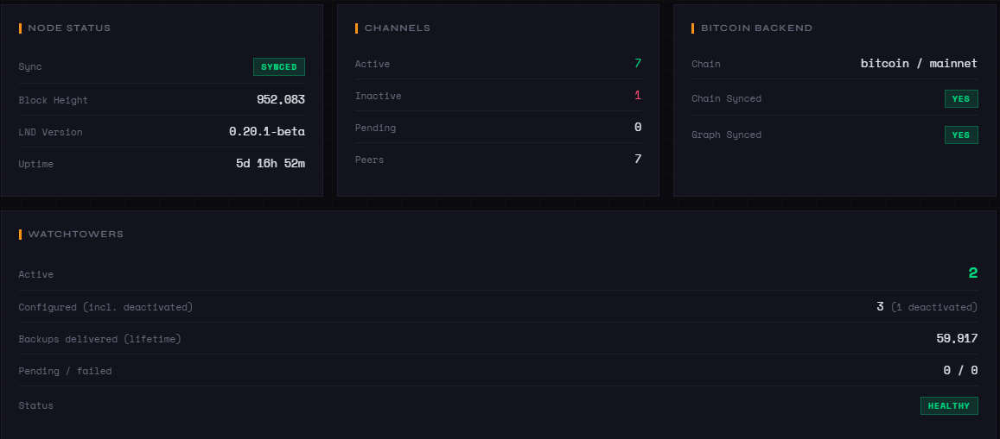
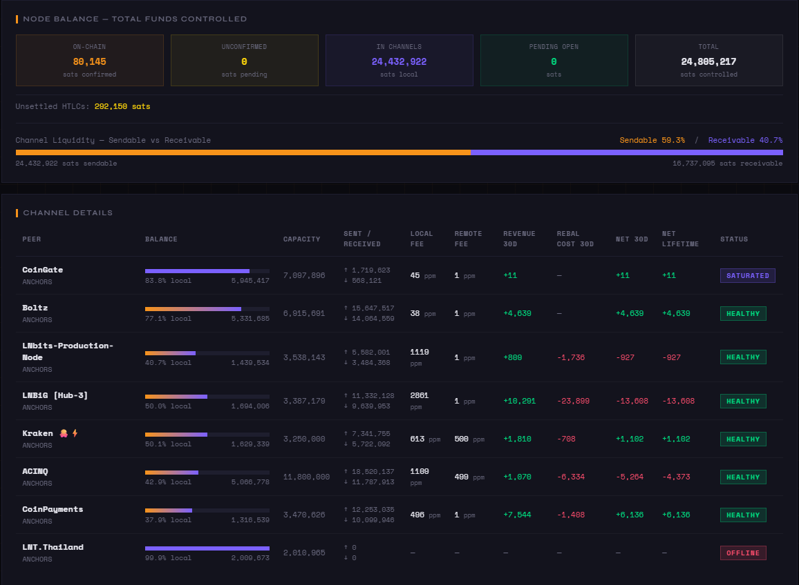
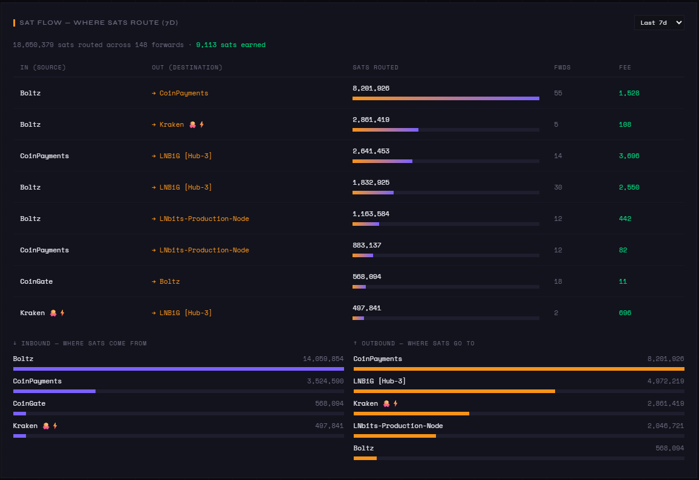
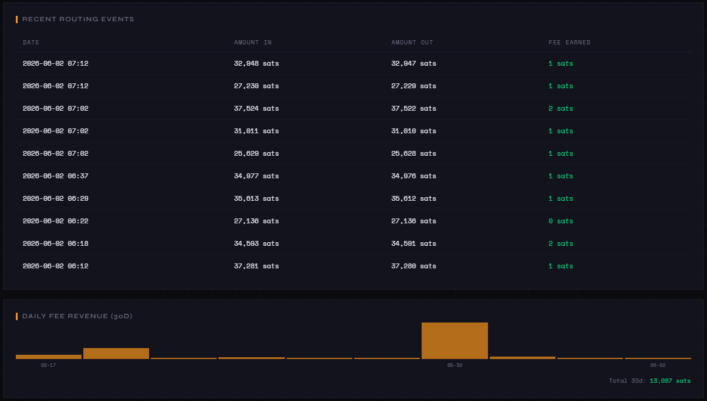
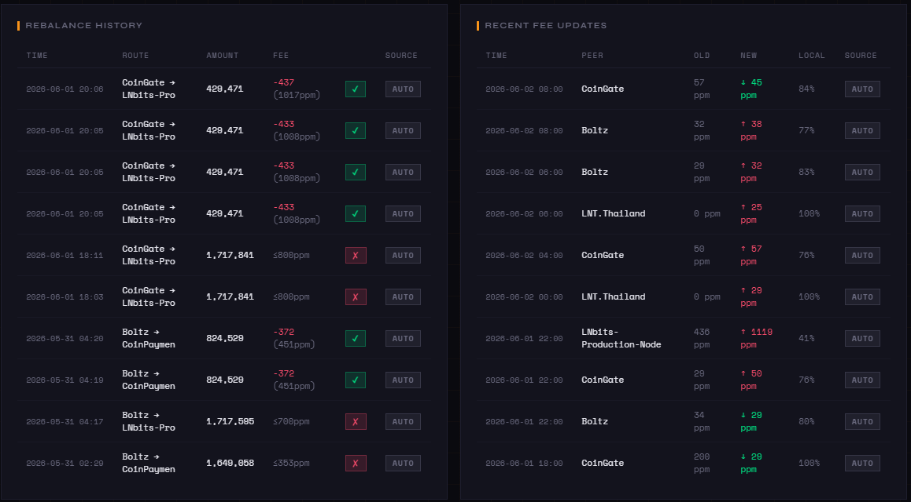
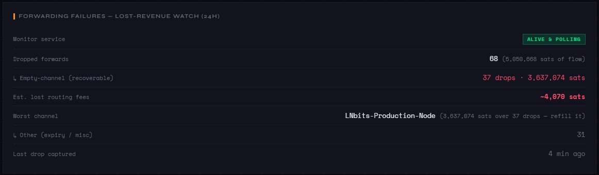

# Dashboard — Web Interface

A single-page Flask app (port 4000, no auth — Tailscale/LAN only) giving
real-time visibility into node health, liquidity, routing, and profit/loss.
It serves live LND data alongside historical data from SQLite: node status,
watchtower health, channel health with balance bars and profit/loss, daily
revenue chart, sat-flow routing map, rebalance history (auto + manual), fee
updates, the forwarding-failure lost-revenue watch, alerts, payments, and
invoices.

## Running it

```bash
venv/bin/python3 dashboard/app.py    # or install services/lnd-dashboard.service
```

Access at `http://YOUR_IP:4000`. No auth — use Tailscale or LAN only. The bind
address is set via `DASHBOARD_BIND_IP` in `.env` and defaults to `127.0.0.1`
(loopback). See the README's **Security** section before exposing it.

## The cards

**At-a-glance node health** — sync, channels, Bitcoin backend, watchtowers:



**Total funds controlled + per-channel health** — balance bars, your/their
fees, 30d revenue, rebalance cost, and net P/L per channel:



**Sat Flow — where routed sats come from and go to** (in→out pairs by volume,
plus inbound/outbound rankings; 30d / 7d / all-time selector):



**Routing events + daily fee revenue:**



**Rebalance history (auto + manual) + recent fee updates:**



**Forwarding-failure lost-revenue watch** — dropped forwards split by cause,
with estimated lost fees on empty channels (a rebalance signal):



## Channel table

The channel table shows local and remote outbound fees side-by-side, pulled
per-channel from `/v1/graph/edge/{chan_id}` so you can see at a glance whether a
peer is undercharging or overcharging relative to you. The flags column surfaces
only things needing attention — offline, private, refill state
(`refilling ≤Nppm` / `refill capped ⛒` / `<budget> stranded` /
`<budget> ⤴` earn-ceiling accelerated — a profitable channel whose anchor sits
far below its earnings, climbing the budget toward what it can afford; hover for
the gap math), an active inbound discount, and a decaying outbound floor. A muted dash means nothing is
flagged. Sibling channels to the same peer share an alias; duplicates are
tagged with a short scid suffix (`·12345`) so the rows stay distinguishable.

## Sat Flow

The **Sat Flow** card answers "where do routed sats come from and where do they
go?" It reads `forwarding_log` (every routed HTLC records both the inbound and
outbound channel) and shows three views of the same data over a selectable
window (30d / 7d / all time): the top in→out peer **pairs** ranked by volume
routed (with a bar, forward count, and fee earned), plus ranked **inbound**
(where liquidity enters) and **outbound** (where it leaves) bar-lists. **In** and
**Out** dropdowns filter every view to a single channel by peer alias, so you can
drill into one peer ("where do sats coming in from Boltz go?" or "where did the
sats leaving via LNBiG come from?"). Channel ids are resolved to peer aliases
from the live channel list; channels closed since a flow occurred show as raw
scids, most visible under "all time".

## Watchtower card

The watchtower card reports tower count, deactivated count, lifetime backups
delivered, pending/failed counters, and an overall health badge. It requires
`wtclient.active=1` in `lnd.conf` (LND only reads the config at startup, so add
it then restart `lnd`); otherwise the card shows "wtclient disabled" in red.
Note that `active_session_candidate` is LND's admin flag, not a liveness probe —
a tower may still be backing up state on existing sessions even when flagged
inactive.

Health badge: **red** when wtclient is disabled, no towers are configured, or any
backup has permanently failed; **yellow** when towers exist but none are active
(all deactivated) or the status read errors; **green** otherwise. Pending is
shown as a number but does not affect the badge — a transient `pending=1` is
normal when a session fills its 1024-update cap and LND negotiates a fresh one,
so it is not treated as a fault. Multiple towers can be configured for failover,
but LND assigns each backup to a single tower rather than mirroring every update
to all of them.
